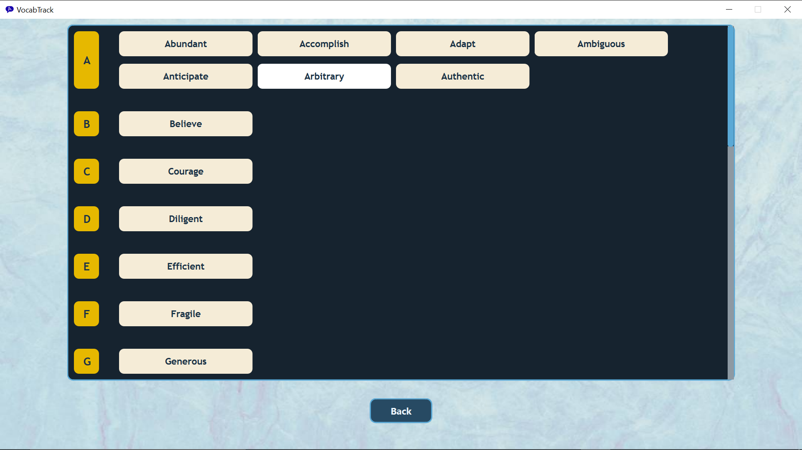
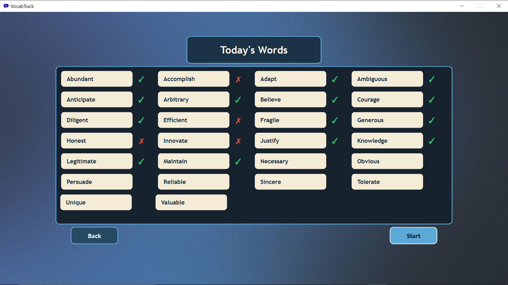
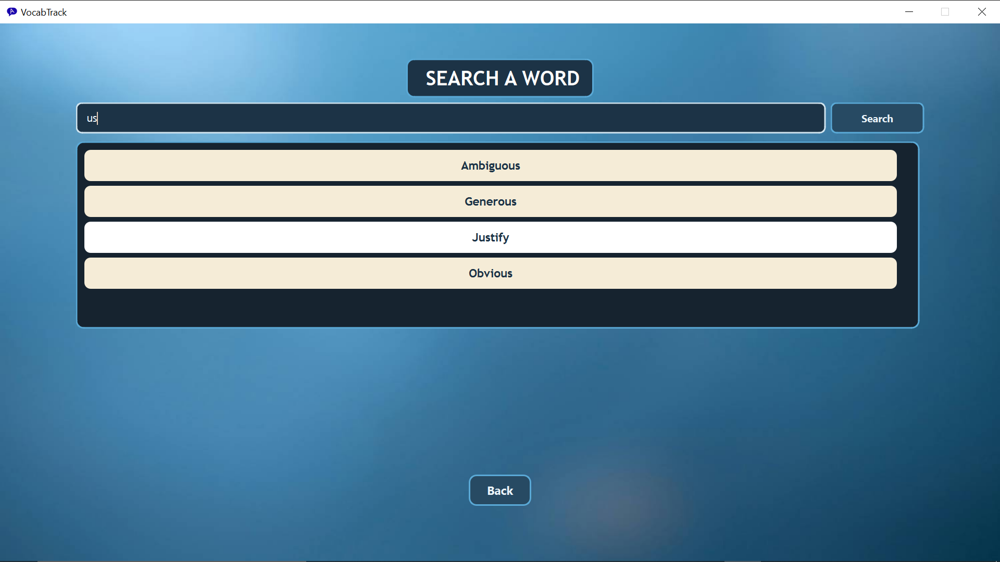
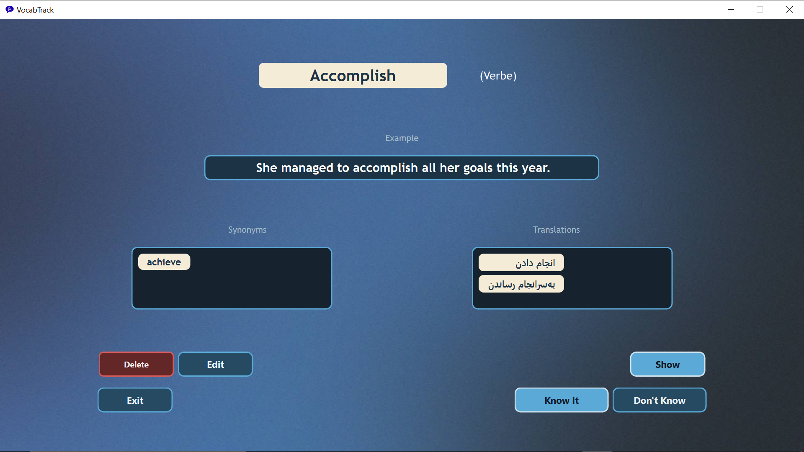
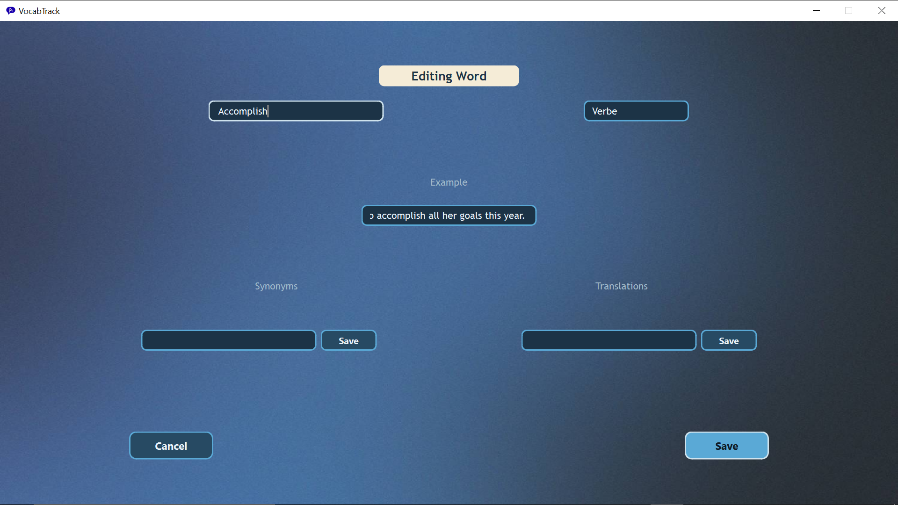
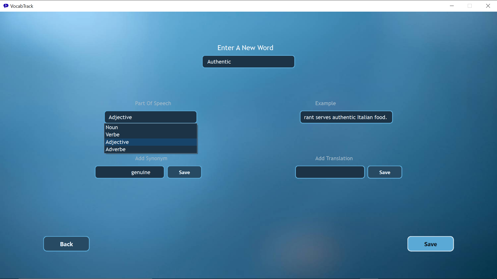
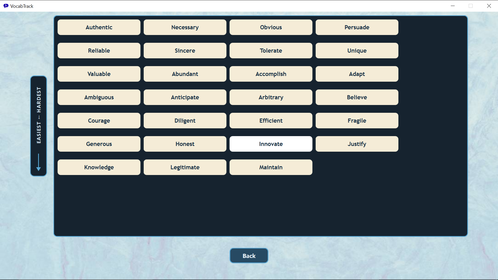

# VocabTrack

A small desktop app I built to help myself remember new English words, using spaced repetition. Built with Qt6 and C++ as a personal project to get more comfortable with modern C++ practices.


## About this project

Records new words with their meaning, part of speech, synonyms, and an example sentence, then schedules reviews using spaced repetition (1 → 2 → 4 → 7 → 16 → 60 days). A personal Qt/C++ learning project.

## Features

- **Add new words** with translation, part of speech, synonyms, and example sentences
- **Daily review queue** — only shows words that are due today, based on the spaced repetition schedule
- **Browse alphabetically** through your entire word list (A–Z)
- **Filter by difficulty** to focus on words you struggle with most
- **Search** to quickly find and edit any word you've added
- **Persistent storage** — your word list is saved automatically and reloaded on every launch

## Screenshots

| A–Z List | Today's Review | Search |
|---|---|---|
|  |  |  |

| Word (View) | Word (Edit) | Add Word |
|---|---|---|
|  |  |  |



## Built With

- **Qt6** (Widgets)
- **C++17**
- **CMake**
- **Qt JSON classes** for data persistence

## Building from source

```bash
git clone https://github.com/Iliya-a006/vocab-track.git
cd vocab-track
cmake -B build -S .
cmake --build build
```

Requires Qt6 (Widgets module) and a C++17-compatible compiler.

## Architecture Notes

- Words are stored as `std::map<QString, std::unique_ptr<Word>, CaseInsensitiveLess>`, giving unique ownership of each `Word` object and automatic case-insensitive alphabetical ordering.
- Data is persisted as JSON and saved to the OS-appropriate app data directory via `QStandardPaths::AppDataLocation`, so the app works correctly even when installed to a protected location like `Program Files`.
- A daily reset mechanism checks on startup whether the review status needs to roll over to a new day, using `QSettings` to track the last active date.

## License

This project is licensed under the MIT License — see the [LICENSE](LICENSE) file for details.
